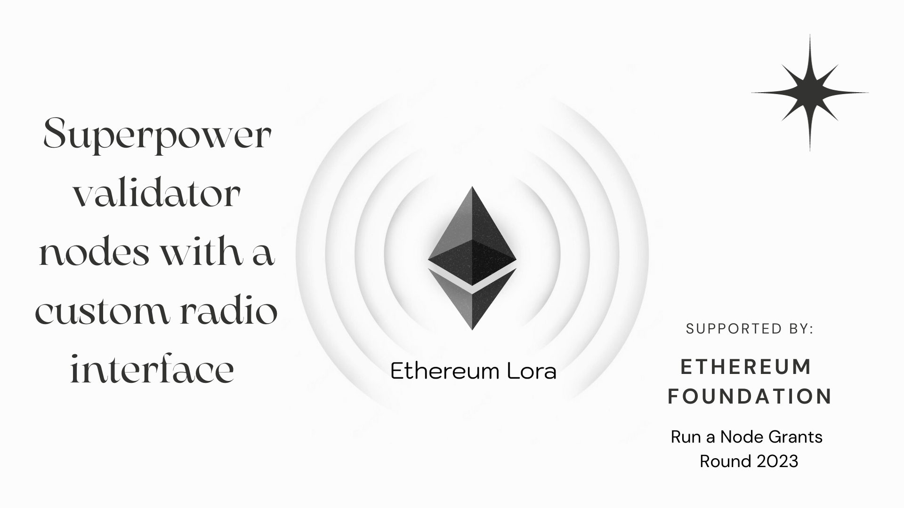
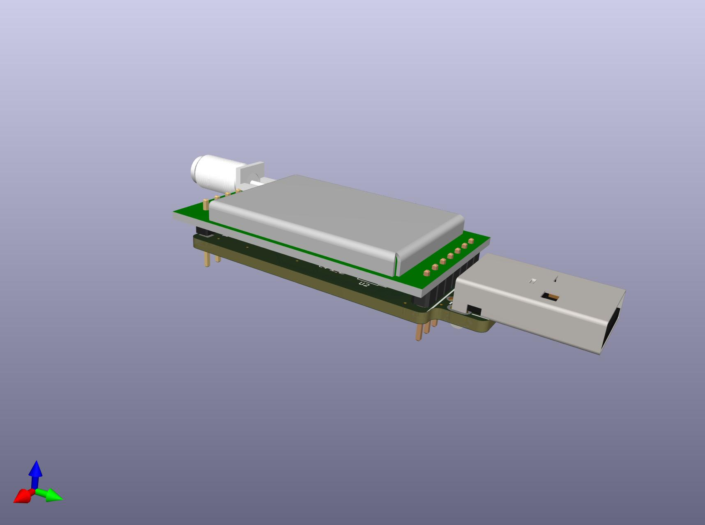

# Ethereum LoRa


## Abstract

**Ethereum LoRa is a project aimed at adding a LoRa radio interface to Ethereum nodes.** By doing so, it becomes possible to query a node with JSON-RPC commands even in locations where Wi-Fi or cellular connectivity is absent. This enhancement allows Ethereum-based services to run in rural or underdeveloped areas of the world, fostering crypto adoption.

### About LoRa

The LoRa Communication System is an innovative project designed to facilitate seamless and efficient communication using the LoRa protocol. Aimed at establishing a reliable medium for data transmission even in challenging conditions, our solution stands as a testament to the powerful blend of software ingenuity and hardware capabilities. Whether it's for remote sensing applications, IoT devices, or any scenario where traditional connectivity might falter, our system ensures that your data reaches its destination.

## Technical Details

The software interfaces with the Ethereum node and the LoRa E22 module, allowing bi-directional communication. When the system starts, it sets up the LoRa module with specific configurations. Users can input JSON payloads, which are then sent via the LoRa interface to an Ethereum node. The system also listens for incoming messages from the Ethereum node, which can then be parsed and presented to the user.

### How It Works
At its core, our system relies on the LoRa (Long Range) protocol, a patented digital wireless data communication technology. Through a combination of software controllers and hardware integrations, the system listens for incoming LoRa messages and parses them for further processing. Depending on the message type—whether it's a handshake or a request—the controller can efficiently interpret and respond to the data.

### Assumptions
- The devices used are compatible with the LoRa E22 chip model.
- The data communicated is structured in JSON format with specific fields, such as "message_type", to allow the system to differentiate between different types of messages.
- The environment variables are correctly set for chip model, serial port, and other necessary pins.

### Implementation
We've designed a modular approach, with a main driver program that leverages two key components: the `ConfigManager` and `LoRaController`. The `ConfigManager` handles configuration retrieval while the `LoRaController` manages the setup, listening, and sending of LoRa messages. When data is received, it's parsed based on its message type and, if it's a request, further extracted to ensure clean and valid JSON content.

### Running the Project Locally

1. Ensure you have Python installed (version 3.x recommended).
2. Clone the repository:  
   ```
   git clone <repository_url>
   ```
3. Navigate to the project directory.
4. Install the required libraries:  
   ```
   pip install -r requirements.txt
   ```
5. Set the necessary environment variables (like `LORA_CHIP_MODEL`, `SERIAL_PORT`, etc.).
6. Run the application:  
   ```
   python client.py
   ```
   Or
   ```
   python server.py
   ```

## Hardware
The BOM is very basic, consisting of a LoRa UART module and a simple PCB TTL-to-UART adapter.

Pins at the bottom of the PCB allow users to upgrade the firmware or select a different working mode, for instance to support re-broadcasting, a form of basic mesh networking.

## Acknowledgements
A big thanks goes to the Ethereum Foundation for sponsoring this project under their "Run a Node" program.

